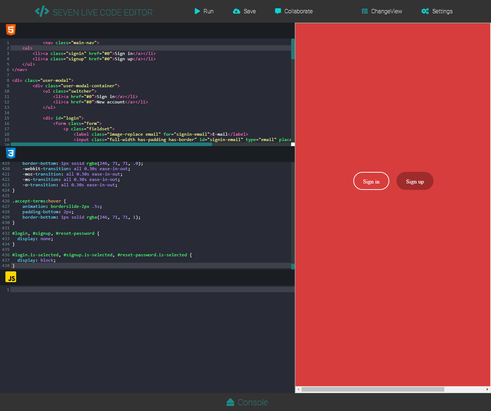
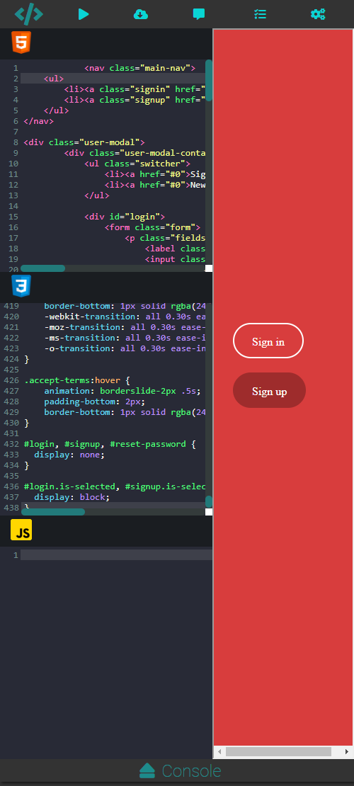

# Seven Live Code Editor

An open source Online code editor playground where you can do  demo and demostrate your front end skills by building complex UI with realtime preview.

## Features

* HTML/CSS/JS Editors
* Preview
* Syntax checks
* Script wrapping
* Auto closetags
* Auto line Numbers
* Isolated iFrame sandbox etc

## Features to be added 
* Realtime collaboration
* Authentication
* Github support
* Splitter around the various sections
* Javascript console.
* ChangeView functionalities
* Full Screen Preview of the results
* You can also suggest a new feature 

## Contributing

All contributors names will be added here
## How to contribute
1. Fork it!
2. Create your feature branch: `git checkout -b my-new-feature`
3. Commit your changes: `git commit -am 'Add some feature'`
4. Push to the branch: `git push origin my-new-feature`
5. Submit a pull request :D

## demo
check it out live  ([link](https://sevencode.netlify.app/))
Desktop View   
Mobile and Tablet View 

### Resources used

codeMirror ([link](https://codemirror.net/))

Google fonts ([link](https://codemirror.net/))

JSBeautifier ([link](http://jsbeautifier.org/))

font Awosome icons ([link](https://fontawesome.com/))

JQuery 1.10.3 ([link](http://blog.jquery.com/2014/12/18/jquery-1-11-2-and-2-1-3-released-safari-fail-safe-edition/))

#### Inspiration
Codepen  ([link](http://codepen.io/))

JSFiddle ([link](http://jsfiddle.net/))

## License

The MIT License (MIT)

Permission is hereby granted, free of charge, to any person obtaining a copy
of this software and associated documentation files (the "Software"), to deal
in the Software without restriction, including without limitation the rights
to use, copy, modify, merge, publish, distribute, sublicense, and/or sell
copies of the Software, and to permit persons to whom the Software is
furnished to do so, subject to the following conditions:

The above copyright notice and this permission notice shall be included in
all copies or substantial portions of the Software.

THE SOFTWARE IS PROVIDED "AS IS", WITHOUT WARRANTY OF ANY KIND, EXPRESS OR
IMPLIED, INCLUDING BUT NOT LIMITED TO THE WARRANTIES OF MERCHANTABILITY,
FITNESS FOR A PARTICULAR PURPOSE AND NONINFRINGEMENT. IN NO EVENT SHALL THE
AUTHORS OR COPYRIGHT HOLDERS BE LIABLE FOR ANY CLAIM, DAMAGES OR OTHER
LIABILITY, WHETHER IN AN ACTION OF CONTRACT, TORT OR OTHERWISE, ARISING FROM,
OUT OF OR IN CONNECTION WITH THE SOFTWARE OR THE USE OR OTHER DEALINGS IN
THE SOFTWARE.
